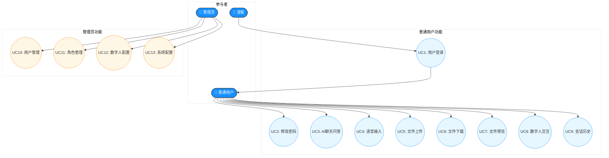

# RuoYi AI 系统用例图

## 图2.1 RuoYi AI 系统用例图

### 说明

该用例图展示了RuoYi AI系统的整体功能全景。从图中可以看出，系统主要涉及三类参与者：**游客**、**普通用户**和**管理员**。游客作为系统外部人员，只能进行注册和登录操作；普通用户登录后可使用AI聊天、文件管理、数字人交互等核心业务功能；管理员拥有系统最高权限，可对用户、角色、数字人配置等进行管理。用例图清晰地呈现了不同角色与系统功能之间的对应关系，便于后续需求分析和权限设计。
