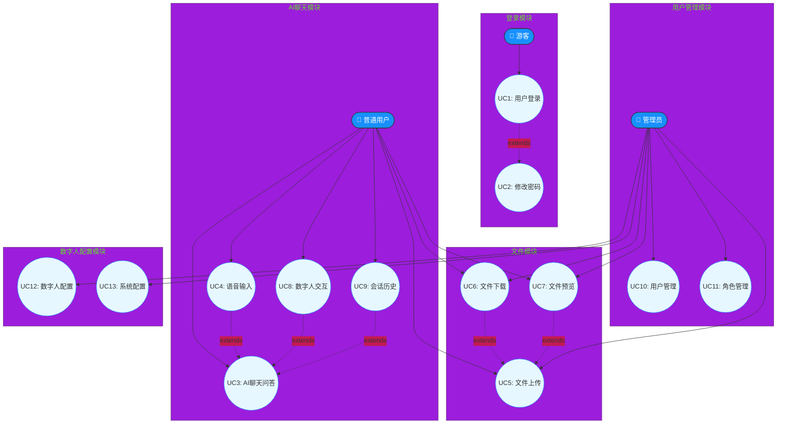

# RuoYi AI 用例关系图

## 图2.2 RuoYi AI 用例关系图

### 说明

用例关系图展示了各用例之间的依赖和扩展关系，主要包括includes（包含）和extends（扩展）两种关系类型。

**包含关系（includes）**：当某个用例的Behavior可以被分解为其他用例可重用的子Behavior时使用包含关系。例如，UC3（AI聊天问答）包含了UC4（语音输入）和UC9（会话历史），这意味着聊天功能复用这两个功能的逻辑；UC10（用户管理）包含UC13（用户数据分析），说明用户管理页面中嵌入了数据分析功能。

**扩展关系（extends）**：当某个用例在特定条件下可能表现出不同Behavior时使用扩展关系。例如，UC2（修改密码）是对UC1（登录）的扩展，表示修改密码是登录后的可选操作；UC8（数字人交互）是对UC3的扩展，表示数字人交互是聊天功能在特定场景下的扩展。

**文件模块关系**：UC6（文件下载）和UC7（文件预览）与UC5（文件上传）存在扩展关系，它们都是在上传功能基础上衍生的相关操作。

通过用例关系图，可以清晰地看到系统功能的复用关系和可扩展点，有助于后续的设计和开发工作。
