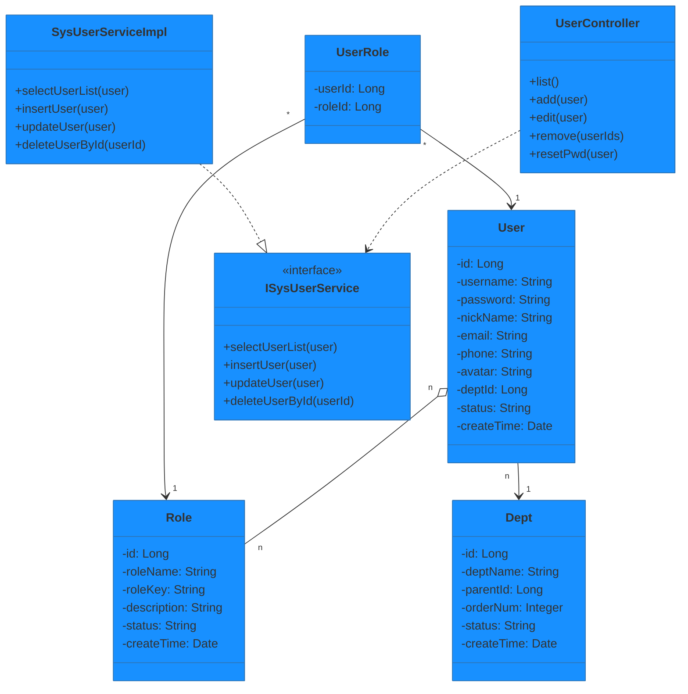
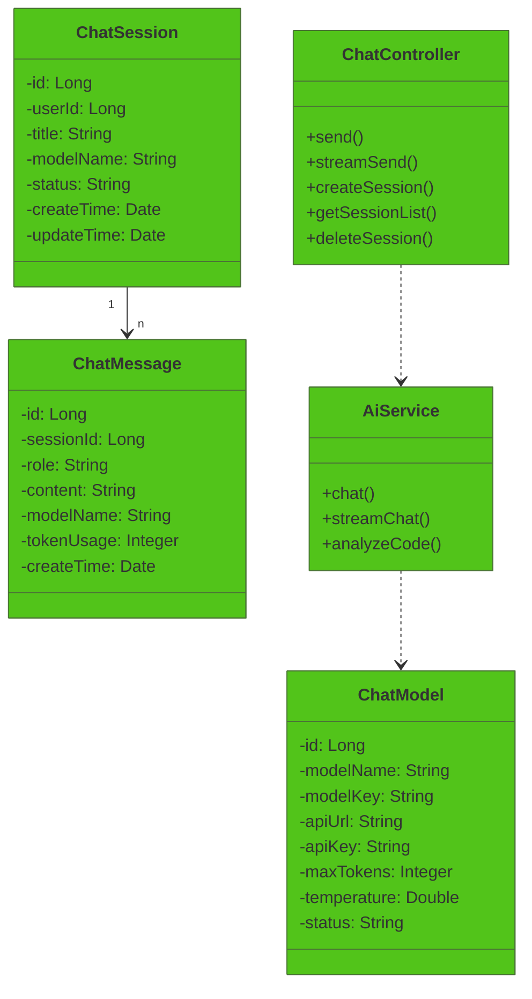
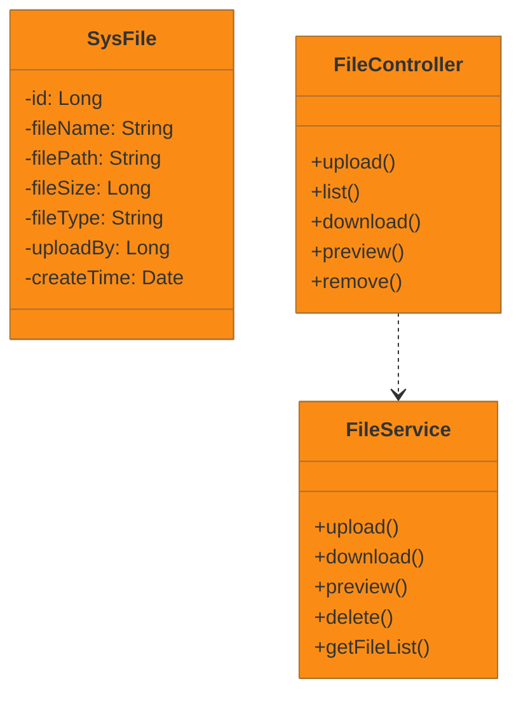
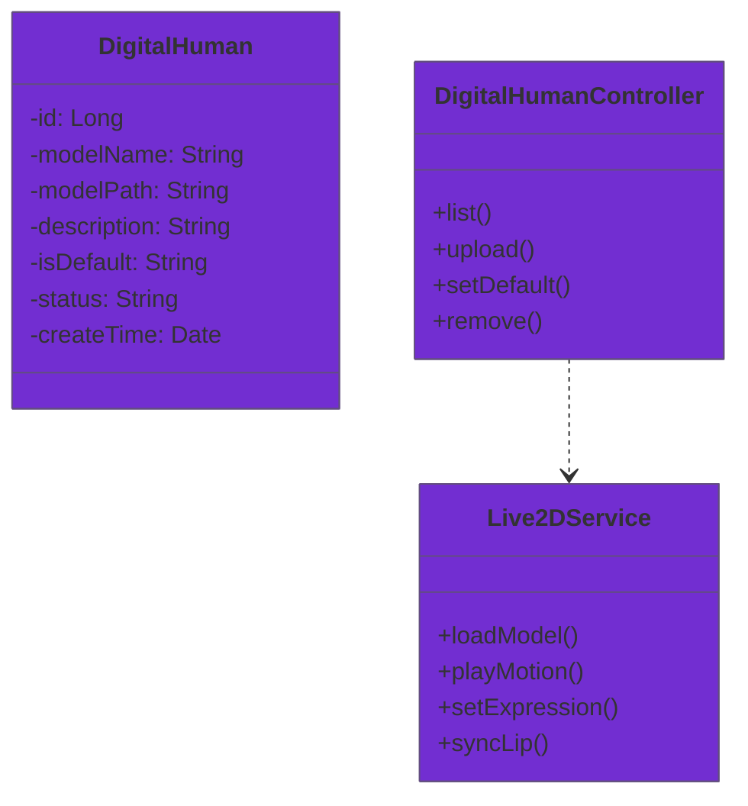

# RuoYi AI 系统类图

## 图3.1 RuoYi AI 系统类图

### 用户管理模块

### AI聊天模块

### 文件模块

### 数字人模块

### 说明

该类图展示了RuoYi AI系统的核心类结构和模块划分，系统按照业务领域划分为四个主要模块：

**用户管理模块**：包含`User`（用户实体）、`Role`（角色实体）、`Dept`（部门实体）和`UserRole`（用户角色关联）四个类。`User`类包含用户的基本属性，如用户名、密码、昵称、邮箱、手机号等；`Role`类定义系统角色；`Dept`类表示组织部门结构；`UserRole`是关联表类，实现用户与角色的多对多关系。类之间的连线表示关联关系，其中`User`与`Role`通过`UserRole`形成n:m的多对多关系，`User`与`Dept`形成1:n的一对多关系。

**聊天模块**：包含`ChatSession`（会话实体）、`ChatMessage`（消息实体）、`ChatModel`（AI模型配置）和`AiService`（AI服务）四个类。`ChatSession`与`ChatMessage`之间是一对多关系，一个会话包含多条消息；`AiService`依赖`ChatModel`获取模型配置信息。

**文件模块**：包含`SysFile`（文件实体）和`FileService`（文件服务）两个类。`SysFile`记录文件的元数据信息，`FileService`提供文件的上传、下载、预览、删除等业务方法。

**数字人模块**：包含`DigitalHuman`（数字人实体）和`Live2DService`（Live2D服务）两个类。`DigitalHuman`存储数字人模型的配置信息，`Live2DService`提供模型加载、动作播放、口型同步等方法。

通过该类图，可以清晰地了解系统中类的结构、属性、方法以及类之间的相互关系，为后续的详细设计和编码实现提供基础。
