# RuoYi AI 类关系类型说明图

## 图3.2 类关系类型说明图

```mermaid
%%{init: {'theme': 'base', 'themeVariables': { 'primaryColor': '#1890ff', 'lineColor': '#333'}}}%%
graph TB
    subgraph 1_继承关系
        direction LR
        G1_1["SysUser
        (用户)"]
        G1_2["LoginUser
        (登录用户)"]
        G1_1 -.->|"extends| 实线空心箭头"| G1_2
    end
    
    subgraph 2_实现关系
        direction LR
        G2_1["<<interface>>
        ISysUserService"]
        G2_2["UserServiceImpl
        (服务实现)"]
        G2_1 -.->|"realizes| 虚线空心箭头"| G2_2
    end
    
    subgraph 3_依赖关系
        direction LR
        G3_1["ChatController
        (控制器)"]
        G3_2["AiService
        (服务)"]
        G3_1 -.->|"uses| 虚线箭头"| G3_2
    end
    
    subgraph 4_关联关系
        direction LR
        G4_1["ChatSession 1
        (会话)"]
        G4_2["ChatMessage n
        (消息)"]
        G4_1 -->|"1:n| 实线箭头"| G4_2
    end
    
    subgraph 5_聚合关系
        direction LR
        G5_1["User
        (用户) 整体"]
        G5_2["Role
        (角色) 部分"]
        G5_1 o-->|"空心菱形| 可独立存在"| G5_2
    end
    
    subgraph 6_组合关系
        direction LR
        G6_1["Dept
        (部门) 整体"]
        G6_2["User
        (用户) 部分"]
        G6_1 -->|"实心菱形| 不可独立存在"| G6_2
    end
    
    style G1_1 fill:#e6f7ff,stroke:#1890ff,color:#333
    style G1_2 fill:#bae7ff,stroke:#1890ff,color:#333
    style G2_1 fill:#d9f7be,stroke:#52c41a,color:#333
    style G2_2 fill:#d9f7be,stroke:#52c41a,color:#333
    style G3_1 fill:#ffe7ba,stroke:#fa8c16,color:#333
    style G3_2 fill:#ffe7ba,stroke:#fa8c16,color:#333
    style G4_1 fill:#ffbb96,stroke:#ff4d4f,color:#333
    style G4_2 fill:#ffbb96,stroke:#ff4d4f,color:#333
    style G5_1 fill:#d8d8d8,stroke:#595959,color:#333
    style G5_2 fill:#d8d8d8,stroke:#595959,color:#333
    style G6_1 fill:#bFBFBF,stroke:#595959,color:#333
    style G6_2 fill:#bFBFBF,stroke:#595959,color:#333
```

### 说明

类关系图展示了类与类之间可能存在的六种关系类型，用于描述系统中的类如何相互作用：

**继承关系（Generalization）**：也称为泛化，表示子类与父类之间的关系。例如`LoginUser`类继承`SysUser`类，子类自动拥有父类的属性和方法，并可以添加自己特有的内容。继承关系使用实线空心箭头表示，箭头指向父类。

**实现关系（Realization）**：表示类对接口的实现。例如`UserServiceImpl`类实现`ISysUserService`接口，这意味着该类必须提供接口中定义的所有方法。实现关系使用虚线空心箭头表示，箭头指向接口。

**依赖关系（Dependency）**：表示一个类使用另一个类，但这种使用是临时的、局部的。例如`ChatController`类依赖`AiService`类进行AI对话处理。依赖关系使用虚线箭头表示。

**关联关系（Association）**：表示类与类之间的持久联系，可以是单向或双向的。例如`ChatSession`与`ChatMessage`之间是一对多关联，一个会话包含多条消息。关联关系使用实线箭头表示，并可标注 multiplicity（多重性）。

**聚合关系（Aggregation）**：是关联关系的一种特殊形式，表示"整体与部分"的关系，但部分可以独立于整体存在。例如用户与角色的关系，用户拥有角色，但角色可以独立存在。聚合关系使用实线空心菱形表示，菱形指向整体。

**组合关系（Composition）**：也是"整体与部分"的关系，但部分不能独立于整体存在。例如部门与用户的关系，当部门被删除时，该部门下的用户账号也需要被处理。组合关系使用实线实心菱形表示，菱形指向整体。
